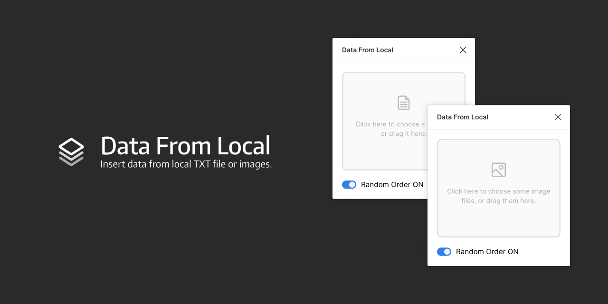

# Data From Local

Figma plugin to insert data from local TXT file or JPG / PNG images.

##### Text Data

Text data must saved as a .TXT file with each data value on a new line.

##### Image Data

Only support JPG and PNG files, you can insert image to any shape layer.

## Installation

Go to [Figma plugins](https://www.figma.com/c/plugin/all) and search "Data From Local".

## License

MIT

## Donate

[Buy me a coffee](https://www.buymeacoffee.com/ashung) or donate [$2.00](https://www.paypal.me/ashung/2) [$5.00](https://www.paypal.me/ashung/5) [$10.00](https://www.paypal.me/ashung/10) via PayPal.

[使用支付宝或微信扫码打赏](https://ashung.github.io/donate.html)